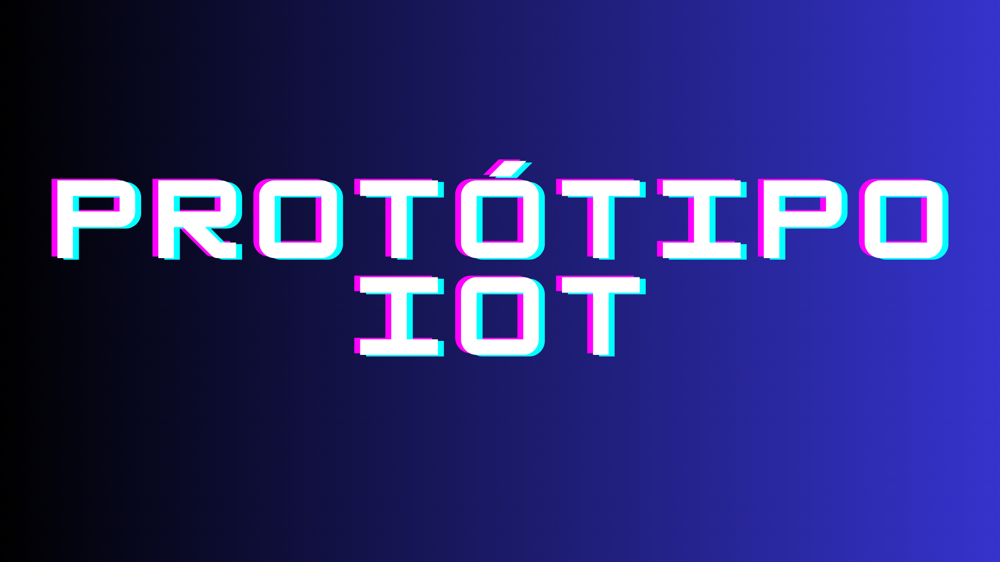
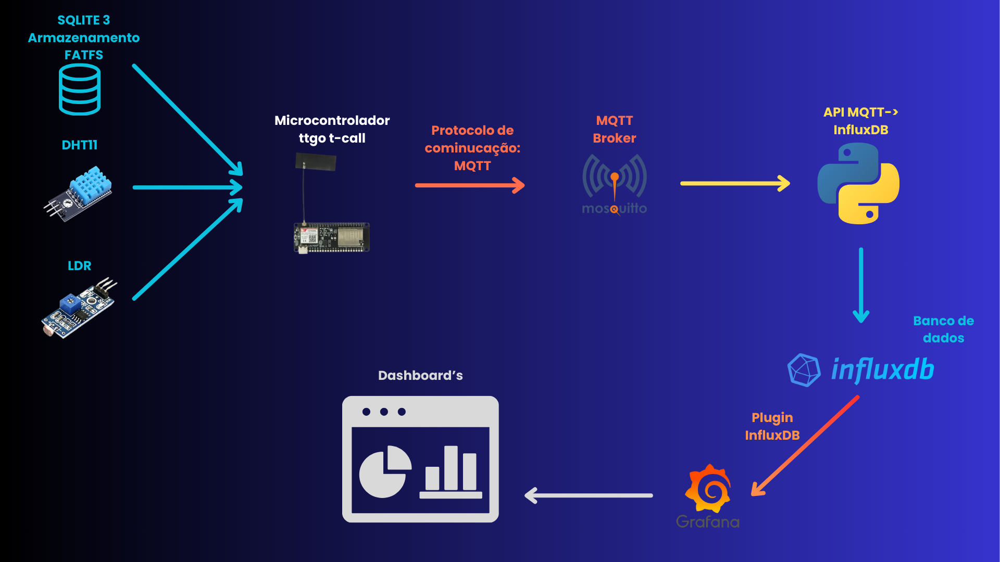

    <picture>
        <h1></h1>
    </picture>
    
Protótipo para coleta de dados para monitoramento de medicamentos conforme a RDC N° 430 disponivel em: <a style="color: #e83e8c" src="https://www.in.gov.br/en/web/dou/-/resolucao-de-diretoria-colegiada-rdc-n-430-de-8-de-outubro-de-2020-282070593">RDC 430 Diário da União</a>

    <h3>Esquema geral do projeto</h3>
    <picture>
      
    </picture>
    
Author: <a style="color: #e83e8c" src="https://github.com/EduardoRanzan">Eduardo Ranzan Ferreira</a>

